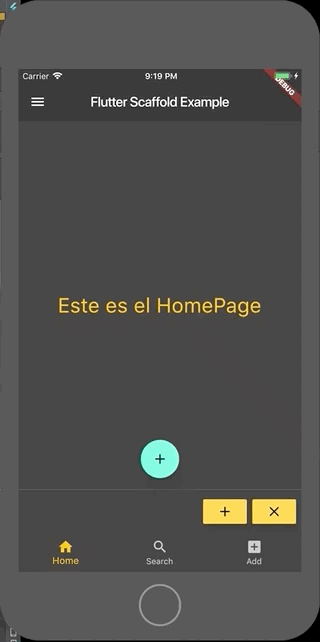

# Scaffold Example

Este es un pequeño ejemplo de los componentes que tiene el Widget Scaffold, todo en Flutter son widgets, pero es importante comprender que trae cada uno de ellos, este ejercicio surgió porque trate de crear un FloatingButton y me generaba un error, todo esto porque es necesario crear primero el Scaffold y luego crear el FloatingButton, el Scaffold tiene muchos componentes adicionales como se puede ver en el gif, por ejemplo el Drawer que es el menú que aparece al lado izquierdo de la pantalla, que se activa presionando el botón de las tres rayas que esta en la parte superior izquierda, este botón se conoce como Hamburger Button.

